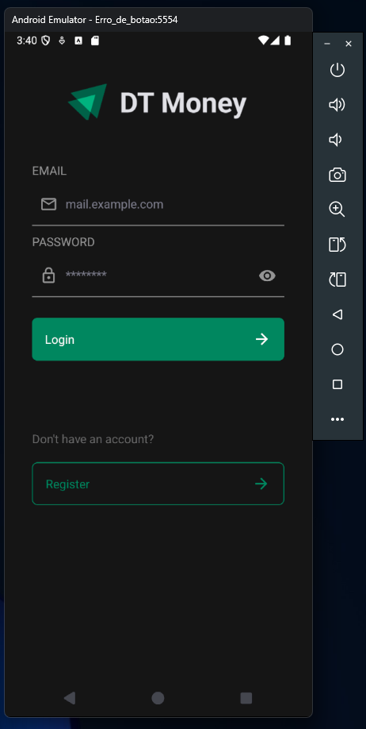
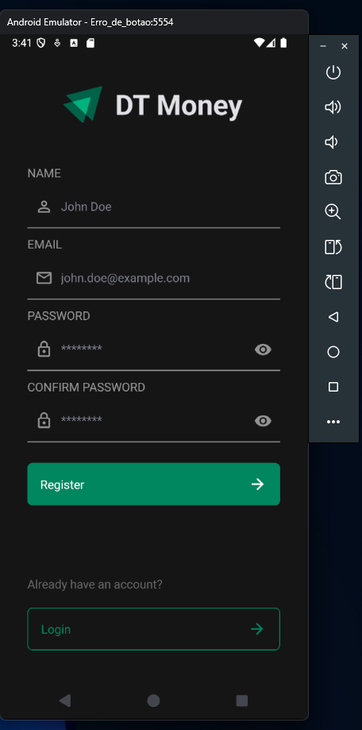
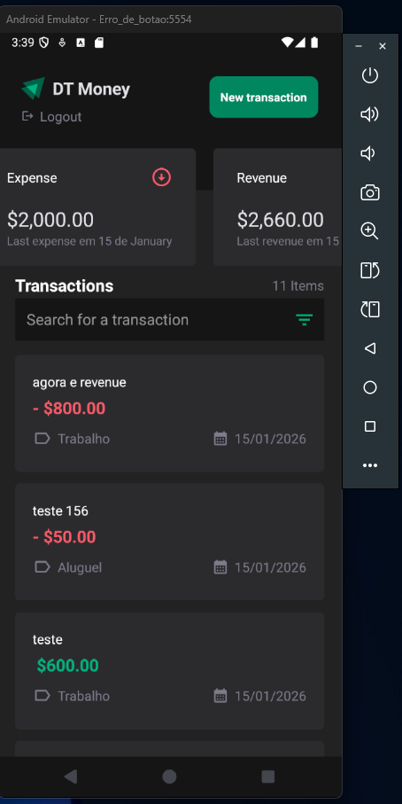
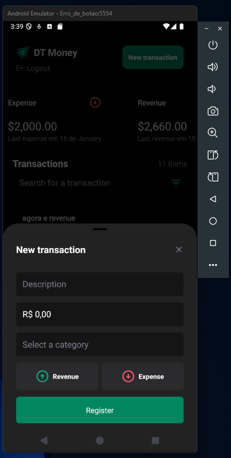
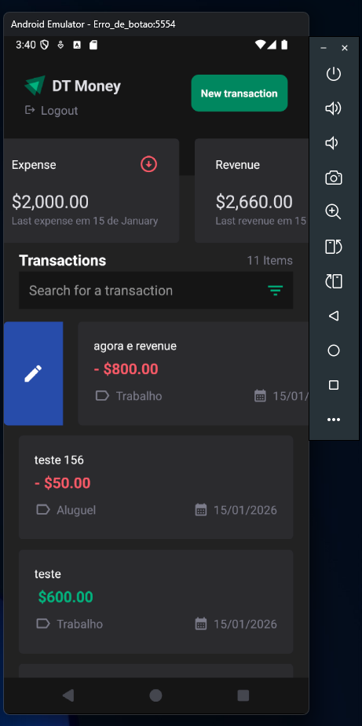
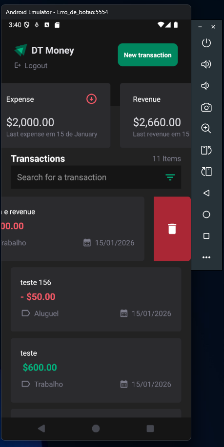
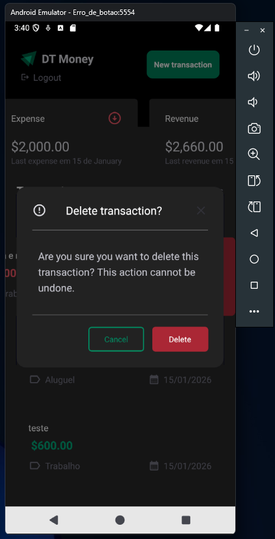

# 💰 DT Money App

Aplicativo mobile de gerenciamento financeiro pessoal desenvolvido com React Native e Expo. Permite que os usuários controlem suas receitas e despesas de forma simples e intuitiva.










## 📋 Índice

- [Sobre o Projeto](#sobre-o-projeto)
- [Funcionalidades](#funcionalidades)
- [Tecnologias Utilizadas](#tecnologias-utilizadas)
- [Pontos Técnicos](#pontos-técnicos)
- [Estrutura do Projeto](#estrutura-do-projeto)
- [Pré-requisitos](#pré-requisitos)
- [Como Rodar](#como-rodar)
- [Scripts Disponíveis](#scripts-disponíveis)
- [Configuração da API](#configuração-da-api)
- [Arquitetura](#arquitetura)

## 🎯 Sobre o Projeto

O **DT Money App** é uma aplicação mobile completa para controle financeiro pessoal, permitindo que usuários registrem, visualizem, editem e excluam transações financeiras (receitas e despesas). O app oferece uma interface moderna e responsiva, com recursos avançados de filtragem e busca.

### Principais Características

- ✅ Autenticação de usuários (Login e Registro)
- ✅ CRUD completo de transações financeiras
- ✅ Sistema de categorias para transações
- ✅ Filtros avançados (data, tipo, categoria)
- ✅ Busca por texto nas transações
- ✅ Paginação infinita com scroll
- ✅ Pull-to-refresh
- ✅ Gestos swipe para ações rápidas (editar/excluir)
- ✅ Feedback visual com Snackbars
- ✅ Interface adaptada para safe areas

## 🚀 Funcionalidades

### Autenticação
- **Login**: Autenticação de usuários existentes
- **Registro**: Criação de novas contas de usuário
- **Persistência de sessão**: Token armazenado no AsyncStorage

### Transações
- **Criar transação**: Adicionar novas receitas ou despesas
- **Visualizar transações**: Lista paginada com scroll infinito
- **Editar transação**: Modificar transações existentes via swipe left
- **Excluir transação**: Remover transações via swipe right
- **Filtros**:
  - Por data (from/to)
  - Por tipo (receita/despesa)
  - Por categoria (múltipla seleção)
- **Busca**: Pesquisa por texto nas descrições
- **Reset de filtros**: Limpar todos os filtros aplicados

### Interface
- **Pull-to-refresh**: Atualizar lista arrastando para baixo
- **Swipeable cards**: Gestos para ações rápidas
- **Bottom Sheet**: Modal para criação/edição de transações
- **Snackbar**: Notificações de sucesso/erro
- **Empty states**: Mensagens quando não há dados
- **Loading states**: Feedback durante carregamentos

## 🛠 Tecnologias Utilizadas

### Core
- **React Native** `0.81.5` - Framework mobile
- **React** `19.1.0` - Biblioteca JavaScript
- **Expo** `~54.0.30` - Plataforma de desenvolvimento
- **TypeScript** `5.9.2` - Tipagem estática

### Navegação
- **@react-navigation/native** `^7.1.26` - Navegação entre telas
- **@react-navigation/stack** `^7.6.13` - Navegação em stack

### Estilização
- **NativeWind** `^4.2.1` - Tailwind CSS para React Native
- **Tailwind CSS** `^3.4.19` - Framework CSS utility-first
- **clsx** `^2.1.1` - Utilitário para classes condicionais

### Formulários e Validação
- **react-hook-form** `^7.68.0` - Gerenciamento de formulários
- **@hookform/resolvers** `^5.2.2` - Resolvers para validação
- **yup** `^1.7.1` - Schema validation

### UI/UX
- **@gorhom/bottom-sheet** `^5.2.8` - Bottom sheet modal
- **react-native-gesture-handler** `~2.28.0` - Gestos e swipe
- **react-native-reanimated** `~4.1.1` - Animações performáticas
- **react-native-safe-area-context** `~5.6.0` - Safe areas
- **react-native-edge-to-edge** `^1.7.0` - Edge-to-edge display

### Utilitários
- **axios** `^1.13.2` - Cliente HTTP
- **date-fns** `^4.1.0` - Manipulação de datas
- **react-native-currency-input** `^1.1.1` - Input de moeda
- **@react-native-async-storage/async-storage** `2.2.0` - Armazenamento local
- **@expo/vector-icons** `^15.0.3` - Ícones

### Desenvolvimento
- **@biomejs/biome** `^2.3.11` - Linter e formatter
- **babel-plugin-module-resolver** `^5.0.2` - Path aliases

## 🔧 Pontos Técnicos

### Arquitetura

#### Context API
O projeto utiliza React Context API para gerenciamento de estado global:
- **AuthContext**: Gerencia autenticação e usuário
- **TransactionContext**: Gerencia transações, filtros e paginação
- **SnackbarContext**: Gerencia notificações
- **BottomSheetContext**: Gerencia modais bottom sheet

#### Hooks Customizados
- `useErrorHandler`: Tratamento centralizado de erros
- `useKeyboardVisible`: Detecção de teclado visível

#### Estrutura de Pastas
```
src/
├── components/     # Componentes reutilizáveis
├── context/       # Contexts do React
├── pages/         # Telas da aplicação
├── routes/        # Configuração de rotas
├── shared/        # Código compartilhado
│   ├── api/      # Configuração do Axios
│   ├── hooks/    # Hooks customizados
│   ├── interfaces/ # Tipos TypeScript
│   ├── services/ # Serviços de API
│   └── utils/    # Funções utilitárias
└── styles/        # Estilos globais
```

### Performance

- **useTransition**: Para operações assíncronas sem bloquear UI
- **useCallback**: Memoização de funções
- **useMemo**: Memoização de valores computados
- **FlatList**: Renderização otimizada de listas
- **React.memo**: Prevenção de re-renders desnecessários

### Gestos e Animações

- **Swipeable**: Cards com gestos swipe para ações rápidas
- **Reanimated**: Animações nativas performáticas
- **Gesture Handler**: Reconhecimento de gestos

### Validação

- **Yup schemas**: Validação de formulários
- **React Hook Form**: Gerenciamento eficiente de formulários
- **Validação em tempo real**: Feedback imediato ao usuário

### Tratamento de Erros

- **AppError**: Classe customizada para erros
- **Interceptors Axios**: Tratamento centralizado de erros HTTP
- **Error Handler Hook**: Hook para tratamento consistente

### Paginação

- **Scroll infinito**: Carregamento sob demanda
- **Prevenção de requisições duplicadas**: Uso de refs
- **Estado de loading**: Feedback visual durante carregamento

## 📁 Estrutura do Projeto

```
dt-money-app/
├── android/              # Código nativo Android
├── assets/              # Imagens e ícones
├── src/
│   ├── components/      # Componentes reutilizáveis
│   │   ├── AppHeader/
│   │   ├── AuthHeader/
│   │   ├── Button/
│   │   ├── Input/
│   │   ├── NewTransaction/
│   │   ├── SelectCategoryModal/
│   │   ├── SelectType/
│   │   └── Snackbar/
│   ├── context/        # Contexts React
│   │   ├── AuthContext.tsx
│   │   ├── BottomSheetContext.tsx
│   │   ├── SnackbarContext.tsx
│   │   └── TransactionContext.tsx
│   ├── pages/          # Telas
│   │   ├── Home/
│   │   │   ├── EmptyList/
│   │   │   ├── ListHeader/
│   │   │   └── TransactionCard/
│   │   ├── Loading/
│   │   ├── Login/
│   │   └── Register/
│   ├── routes/         # Rotas
│   │   ├── PrivateRoutes/
│   │   ├── PublicRoutes/
│   │   └── index.tsx
│   ├── shared/         # Código compartilhado
│   │   ├── api/
│   │   ├── enums/
│   │   ├── helpers/
│   │   ├── hooks/
│   │   ├── interfaces/
│   │   ├── services/
│   │   └── utils/
│   ├── styles/
│   ├── App.tsx
│   └── index.ts
├── .expo/
├── .vscode/
├── app.json
├── babel.config.js
├── biome.json
├── metro.config.js
├── package.json
├── tailwind.config.js
└── tsconfig.json
```

## 📋 Pré-requisitos

Antes de começar, você precisa ter instalado:

- **Node.js** (versão 18 ou superior)
- **npm** ou **yarn**
- **Expo CLI** (instalado globalmente ou via npx)
- **Git**
- **Backend API** rodando (veja [Configuração da API](#configuração-da-api))

### Para desenvolvimento Android:
- **Android Studio** com Android SDK
- Emulador Android configurado OU dispositivo físico com USB debugging

### Para desenvolvimento iOS (apenas macOS):
- **Xcode** (versão mais recente)
- **CocoaPods**
- Simulador iOS OU dispositivo físico

## 🚀 Como Rodar

### 1. Clone o repositório

```bash
git clone <url-do-repositorio>
cd dt-money-app
```

### 2. Instale as dependências

```bash
npm install
# ou
yarn install
```

### 3. Configure a API

Edite o arquivo `src/shared/api/dt-money.ts` e ajuste a `baseURL` conforme necessário:

```typescript
const baseUrl = Platform.select({
  ios: 'http://localhost:3001',      // Para iOS Simulator
  android: 'http://10.0.2.2:3001',   // Para Android Emulator
  // Para dispositivo físico, use o IP da sua máquina na rede local
})
```

### 4. Inicie o servidor de desenvolvimento

```bash
npm run dev
# ou
yarn dev
```

Isso iniciará o Expo Dev Server. Você verá um QR code no terminal.

### 5. Execute no dispositivo/emulador

#### Android:
```bash
npm run android
# ou
yarn android
```

#### iOS (apenas macOS):
```bash
npm run ios
# ou
yarn ios
```

#### Web:
```bash
npm run web
# ou
yarn web
```

### 6. Usando Expo Go (dispositivo físico)

1. Instale o app **Expo Go** na App Store (iOS) ou Google Play (Android)
2. Escaneie o QR code exibido no terminal
3. O app será carregado no seu dispositivo

## 📜 Scripts Disponíveis

| Script | Descrição |
|--------|-----------|
| `npm run dev` | Inicia o servidor de desenvolvimento Expo |
| `npm run android` | Executa o app no emulador/dispositivo Android |
| `npm run ios` | Executa o app no simulador/dispositivo iOS |
| `npm run web` | Executa o app no navegador web |
| `npm run check` | Executa o linter (Biome) e corrige problemas automaticamente |

## 🔌 Configuração da API

O app se conecta a uma API backend. Certifique-se de que:

1. A API está rodando na porta `3001`
2. Para **Android Emulator**: use `http://10.0.2.2:3001`
3. Para **iOS Simulator**: use `http://localhost:3001`
4. Para **dispositivo físico**: use o IP da sua máquina na rede local (ex: `http://192.168.1.100:3001`)

### Endpoints esperados pela API:

- `POST /auth/login` - Autenticação
- `POST /auth/register` - Registro
- `GET /transactions` - Listar transações (com query params para filtros)
- `POST /transactions` - Criar transação
- `PUT /transactions/:id` - Atualizar transação
- `DELETE /transactions/:id` - Excluir transação
- `GET /categories` - Listar categorias

## 🏗 Arquitetura

### Fluxo de Autenticação

1. Usuário faz login/registro
2. Token JWT é armazenado no AsyncStorage
3. Token é adicionado automaticamente aos headers das requisições
4. Rotas privadas são acessíveis apenas com token válido

### Fluxo de Transações

1. **Carregamento inicial**: Busca categorias e primeira página de transações
2. **Filtros**: Aplicação de filtros atualiza a lista automaticamente
3. **Paginação**: Scroll infinito carrega mais transações
4. **CRUD**: Operações de criar/editar/excluir atualizam o estado global

### Gerenciamento de Estado

- **Context API**: Estado global compartilhado
- **Local State**: Estado específico de componentes
- **AsyncStorage**: Persistência de dados (token, preferências)

### Tratamento de Erros

1. Erros HTTP são interceptados pelo Axios
2. Convertidos em `AppError` com mensagem amigável
3. Exibidos via Snackbar para o usuário
4. Logados no console para debug

## 🎨 Design System

O projeto utiliza um sistema de cores customizado definido em `src/shared/colors.ts`:

- **Cores de marca**: `accent-brand-*`
- **Cores de erro**: `accent-red-*`
- **Cores de fundo**: `background-primary`, `background-secondary`, `background-tertiary`
- **Cores de texto**: `gray-*`, `white`

Todas as cores são integradas ao Tailwind via `tailwind.config.js`.

## 📱 Compatibilidade

- **Android**: 5.0+ (API level 21+)
- **iOS**: 13.0+
- **Web**: Navegadores modernos (Chrome, Firefox, Safari, Edge)

## 🔒 Segurança

- Tokens JWT armazenados de forma segura no AsyncStorage
- Validação de formulários no cliente
- Sanitização de inputs
- Headers de autenticação automáticos

## 🐛 Troubleshooting

### Erro de conexão com API
- Verifique se a API está rodando
- Confirme a URL base no arquivo `dt-money.ts`
- Para dispositivo físico, use o IP da máquina na rede local

### Erro de build Android
- Execute `cd android && ./gradlew clean`
- Delete a pasta `node_modules` e reinstale

### Erro de build iOS
- Execute `cd ios && pod install`
- Limpe o build: `Product > Clean Build Folder` no Xcode

### Problemas com NativeWind
- Limpe o cache: `npx expo start -c`
- Verifique se o `babel.config.js` está configurado corretamente
